<div align="center">

# 👋 Hey, I'm Muhammad Ali

### 🚀 Senior Gen AI Engineer | Python Backend Specialist | Multi-Agent Systems Architect
**5+ Years Building Production Systems · 2 Years Agentic AI · LangGraph Orchestration · Enterprise RAG**

[](https://linkedin.com/in/muhammad-ali-jt)
[](mailto:mdotali533@gmail.com)
[](https://ali.teknikki.com)


</div>

---

<div align="center">

### 🎯 **Currently: AI/LLM Engineer @ Kavak · Previously: Team Lead Gen AI @ Cloudpacer**
*3+ years engineering Django/FastAPI backends · 2 years building enterprise Agentic AI platforms · 1,000+ daily AI interactions in production*

</div>

---

## 🚀 What I'm Building

<table>
<tr>
<td width="50%" valign="top">

### 🤖 Navi AI (Kavak)
**Multi-Agent Customer Support Orchestrator**
- 🚗 Latin America's leading car marketplace
- 💬 1,000+ daily customer interactions
- 🧠 LangGraph Supervisor architecture
- 🔄 Multi-agent orchestration (Sales/Supply/Deals)
- 📞 WhatsApp chatbot + Synthflow voicebot
- ⚡ 65% reduction in response time

</td>
<td width="50%" valign="top">

### 🚛 Neblo AI (Cloudpacer)
**AI-Powered Broker Agent for Trucking**
- 💼 Serving U.S. trucking industry
- 💬 1,000+ daily autonomous conversations
- 📱 Telegram & WhatsApp integration
- ⚡ Response time: 45min → <2min
- 🏗️ Django + FastAPI + RabbitMQ
- 🤖 24/7 automated operations

</td>
</tr>
<tr>
<td width="50%" valign="top">

### 🧞 CloudGenie (Cloudpacer)
**Intelligent Text-to-SQL Agent**
- 💭 Natural language → SQL queries
- 🎯 92% query accuracy
- 📊 RAG-based semantic understanding
- 🔍 Multi-schema support
- ⚡ FastAPI + PostgreSQL backend
- 🧠 Context-aware business logic

</td>
<td width="50%" valign="top">

### 🏢 Enterprise E-commerce Platform (Ginkgo Retails)
**Multi-Tenant SaaS Integration Engine**
- 👥 150+ retail clients
- 📦 10,000+ daily transactions
- 🔄 ERP integration (SAP, Dynamics, Oracle, Odoo)
- 🛒 Shopify, WooCommerce, Magento, Daraz connectors
- ⚡ 40% faster order processing
- 📈 35% improved inventory accuracy

</td>
</tr>
</table>

---

## 💡 Specialized Expertise

<div align="center">

```python
class MuhammadAli:
    """Senior Gen AI Engineer & Python Backend Specialist
    3+ years Django/FastAPI backends → 2 years Agentic AI architecture"""

    title = "Senior Gen AI Engineer | Python Backend Specialist"
    location = "Lahore, Pakistan"
    experience = "5+ years total · 2 years Agentic AI · 3+ years Backend Engineering"

    companies = ["Kavak (Contractor)", "Cloudpacer", "Ginkgo Retails"]

    @staticmethod
    def agentic_ai_systems():
        return {
            "architectures": [
                "LangGraph Supervisor Patterns",
                "Multi-Agent Orchestration",
                "Policy-Driven Routing",
                "Dynamic Context Synthesis",
                "Human-in-the-Loop Escalation"
            ],
            "frameworks": ["LangChain", "LangGraph", "CrewAI", "AutoGen", "PydanticAI"],
            "production_scale": "1,000+ daily interactions at 99.5% uptime"
        }

    @staticmethod
    def rag_pipelines():
        return {
            "techniques": [
                "Advanced RAG Architectures",
                "Semantic Search & Retrieval",
                "Context Window Optimization",
                "Vector Database Design"
            ],
            "vector_stores": ["Pinecone", "Chroma", "FAISS", "Qdrant", "Weaviate", "Milvus"],
            "embeddings": ["OpenAI", "Sentence-Transformers", "Cohere"]
        }

    @staticmethod
    def llm_engineering():
        return {
            "models": ["OpenAI GPT-4", "Claude", "Gemini", "Llama", "Mistral"],
            "platforms": ["OpenAI API", "Anthropic API", "GROQ", "Together AI"],
            "techniques": [
                "Prompt Engineering",
                "Chain-of-Thought",
                "Few-Shot Learning",
                "Fine-tuning (LoRA, SFT, PEFT)",
                "Tool Calling & Function Orchestration"
            ]
        }

    @staticmethod
    def backend_architecture():
        return {
            "frameworks": ["FastAPI", "Django", "Flask"],
            "databases": ["PostgreSQL", "MySQL", "Redis", "MongoDB"],
            "messaging": ["RabbitMQ", "Kafka", "Celery"],
            "patterns": [
                "Microservices Architecture",
                "Event-Driven Systems",
                "RESTful APIs",
                "WebSockets",
                "gRPC"
            ],
            "scale": "10,000+ transactions/day for 150+ enterprise clients"
        }

    @staticmethod
    def research_and_ml():
        return {
            "fellowship": "DAAD Research Fellow — RPTU Kaiserslautern-Landau, Germany",
            "computer_vision": ["CNNs", "GANs", "Object Detection", "Multispectral Imaging"],
            "frameworks": ["TensorFlow", "PyTorch", "Scikit-learn"],
            "accuracy": "89% pest detection · 92% flood mapping"
        }
```

</div>

---

## 🛠️ Tech Stack Arsenal

<div align="center">

### 🤖 AI/ML Frameworks & Tools


### ⚙️ Backend & Infrastructure


### 🗄️ Databases & Vector Stores


### ☁️ Cloud & DevOps


</div>

---

## 🎓 Education & Recognition

<table>
<tr>
<td align="center" width="33%">

### 🥇 Gold Medalist
**BS Software Engineering**
Riphah International University
*CGPA: 3.91/4.0*
*Valedictorian · Summa Cum Laude*
*Dean's List All Semesters*
**FYP:** Food Auxiliary — ML-powered food recommendation system (Django + Random Forest + OpenFoodFacts)

</td>
<td align="center" width="33%">

### 🎓 Master's Degree
**MS Data Science**
NUST Pakistan
*CGPA: 3.3/4.0*
*Focus: ML, DL, NLP, CV*
*Graduated 2022*
**Thesis:** Flood Inundation Mapping using Multi-Temporal SAR Imagery & Google Earth Engine

</td>
<td align="center" width="33%">

### 🌍 DAAD Research Fellow
**RPTU Kaiserslautern-Landau**
*Germany (2022)*
Computer Vision in
Precision Agriculture
*89% Pest Detection Accuracy*
Via Machine Vision & Intelligent Systems Lab, NUST

</td>
</tr>
</table>

---

## 📊 Impact Metrics

<div align="center">

| Metric | Achievement |
|--------|-------------|
| 🤖 AI Agents Deployed | 4+ Production Systems |
| 💬 Daily AI Interactions | 1,000+ per system |
| ⚡ Response Time Improvement | 65–96% reduction |
| 🏢 Enterprise Clients Served | 150+ |
| 📦 Daily Transactions Processed | 10,000+ |
| 👥 Team Leadership | 4 AI Engineers |
| 🎯 System Uptime | 99.5% |
| 🔍 Query Accuracy (SQL Agent) | 92% |
| 📈 Inventory Accuracy Improvement | 35% |
| 🌾 Computer Vision Model Accuracy | 89–92% |

</div>

---

## 🏆 Notable Projects

### 🚗 **Navi AI — Multi-Agent Customer Support** (2024–2025)
Enterprise AI orchestration system for Kavak (Latin America's largest car marketplace)
- **Architecture**: LangGraph Supervisor managing multi-agent conversations
- **Agents**: Domain-specific specialists (Sales, Supply, Deal managers)
- **Channels**: WhatsApp chatbot (Navi) + Voicebot (Neha via Synthflow)
- **Features**: Policy-driven routing, dynamic context synthesis, human escalation
- **Scale**: 1,000+ daily customer interactions across car buying/selling workflows
- **Impact**: 65% response time reduction, improved reliability & debuggability

### 🌊 **Flood Inundation Mapping System** (2022) · *MS Thesis*
Geospatial AI for disaster management using SAR imagery
- **Coverage**: 10,000+ sq km flood monitoring
- **Accuracy**: 92% automated flood detection
- **Tech**: Google Earth Engine, Sentinel-1 SAR, Random Forest, CNN, NDWI
- **Impact**: Actionable insights for government agencies & NGOs

### 🤖 **FaceGAN & CNN Vision Models** (2020–2021) · *Freelance*
Computer vision and generative AI projects for international clients
- **FaceGAN**: Image generation and enhancement using GANs
- **LLM Course Generator**: Automated structured learning content using generative AI workflows
- **Tech**: Python, TensorFlow, PyTorch, GANs, LLM APIs

### 🍎 **Food Auxiliary** (2020) · *Final Year Project*
ML-powered food recommendation system — BS Software Engineering capstone
- **Stack**: Django + Random Forest + OpenFoodFacts dataset
- **Purpose**: Personalised, nutrition-aware meal suggestions

---

## 💼 Professional Journey

```mermaid
timeline
    title Career Progression
    2016 : Started BS Software Engineering
    2020 : BS Gold Medalist & Valedictorian (Riphah)
         : Freelance AI & ML Engineer (Fiverr)
         : CNN models · FaceGAN · LLM course generator
    2022 : MS Data Science — NUST
         : Research Assistant — Machine Vision & Intelligent Systems Lab
         : DAAD Research Fellow — RPTU Kaiserslautern-Landau, Germany
    2023 : Software Engineer (Ginkgo Retails)
         : Built e-commerce platform for 150+ enterprise clients
    2024 : Team Lead Gen AI/ML Software Engineer (Cloudpacer)
         : Led team of 4 AI engineers · 3 production AI systems
    2025 : AI/LLM Engineer Contractor (Kavak)
         : Multi-agent platform · 1000+ daily interactions
```



---

## 🌟 What I Bring to the Table

✅ **Backend-First AI Engineering** — 3+ years Django/FastAPI discipline before pivoting to AI; I build AI systems that actually scale  
✅ **Production-Grade Agentic AI** — Deployed systems handling 1,000+ daily interactions at 99.5% uptime  
✅ **Multi-Agent Orchestration** — Expert in LangGraph Supervisor patterns, policy-driven routing & agentic workflows  
✅ **Enterprise Architecture** — Scalable microservices, event-driven systems, ERP integrations  
✅ **Research Pedigree** — DAAD Research Fellow, MS Data Science (NUST), Gold Medalist BS  
✅ **Technical Leadership** — Led teams, established ML deployment best practices, code reviews  
✅ **Cross-Domain Experience** — Automotive (Kavak/LATAM), logistics (US trucking), retail (150+ clients), precision agriculture (Germany)

---

## 🤝 Let's Connect

<div align="center">

I'm passionate about building intelligent systems that solve real-world problems.
Always open to discussing:

🔬 **AI Research Collaboration** • 🏢 **Enterprise AI Solutions** • 💡 **Consulting & Advisory** • 🌐 **Open Source Contributions**

[](https://linkedin.com/in/muhammad-ali-jt)
[](mailto:mdotali533@gmail.com)
[](https://ali.teknikki.com)

---


⭐ **"Together we learn, better we grow"**

*Last Updated: February 2026*

</div>
